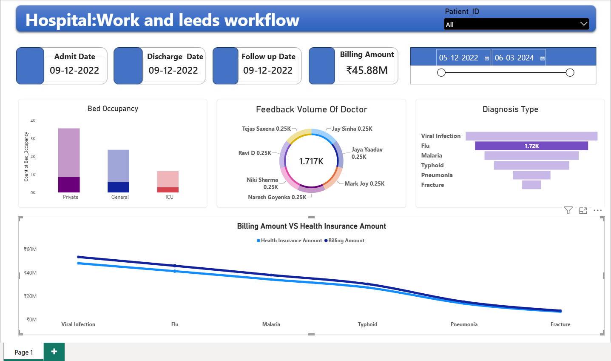

# Apollo Healthcare Data Analysis – Power BI

## Project Overview

This project focuses on analyzing Apollo healthcare data using Power BI to identify key business trends, operational patterns, and performance insights.

The dashboard transforms raw healthcare data into interactive visualizations and KPIs that can support data-driven decision-making.

## Tools & Technologies

* Power BI
* Power Query
* DAX
* Excel
* Data Cleaning
* Data Transformation
* Data Visualization
* Exploratory Data Analysis

## Key Analysis

The dashboard provides insights into:

* Patient ID and patient-level healthcare records
* Admission Date, Discharge Date, and Follow-up Date analysis
* Billing Amount and healthcare revenue analysis
* Billing Amount vs. Health Insurance Amount comparison
* Bed Occupancy and hospital utilization trends
* Doctor Feedback Volume analysis
* Diagnosis Type distribution and trends
* Date-wise healthcare and billing analysis
* Patient journey from admission through follow-up

## Dashboard

The Power BI dashboard contains interactive visuals and KPI cards that allow users to explore healthcare data from different perspectives.

## Screenshot

## Files Included

* `Apollo PowerBI Data Analysis.pbix` – Power BI dashboard file
* `Apollo-Dataset.xlsx` – Dataset used for analysis
* `1.png` – Power BI dashboard screenshot

## Skills Demonstrated

* Data Cleaning
* Data Transformation
* Power BI Dashboard Development
* DAX
* KPI Analysis
* Data Visualization
* Business Analysis
* Exploratory Data Analysis

## Project Purpose

The objective of this project is to demonstrate the ability to transform raw healthcare data into meaningful business insights using Power BI and data analytics techniques.
